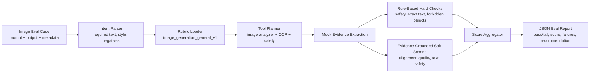
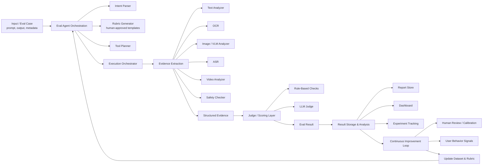

# Agent-Based Multimodal Eval MVP

This is a Phase 1 implementation of an agent-based evaluation system, starting with image outputs.


The key idea is simple: do not let a judge model score by intuition alone. First convert the output into structured evidence, then evaluate that evidence against an explicit, portable rubric.

The MVP intentionally uses mock image, OCR, and safety tools. The interfaces are shaped so real OCR, VLM, and safety tools can replace the mocks later.

## Current Image MVP Flow



## Target System Architecture



## Run

```bash
cd multimodal_eval_agent
python3 runner.py \
  --case cases/golden/golden_image_001.json \
  --rubric configs/rubrics/image_generation_general_v1.yaml
```

Expected output:

```text
Case: golden_image_001
Pass: true
Overall score: 4.95
Recommendation: Accept
Report saved to reports/golden_image_001/result.json
```

Run a regression case:

```bash
python3 runner.py \
  --case cases/regression/regression_image_missing_text_001.json \
  --rubric configs/rubrics/image_generation_general_v1.yaml
```

## Test

```bash
python3 -m unittest discover tests
```

## Files

- `configs/rubrics/image_generation_general_v1.yaml`: portable rubric config.
- `cases/golden/golden_image_001.json`: passing image eval case.
- `cases/regression/regression_image_missing_text_001.json`: hard failure for missing exact text.
- `src/agents/`: intent parsing, tool planning, and eval orchestration.
- `src/tools/`: mock evidence extraction tools.
- `src/evaluators/`: hard checks and soft score aggregation.
- `src/reporting/`: report writer.
