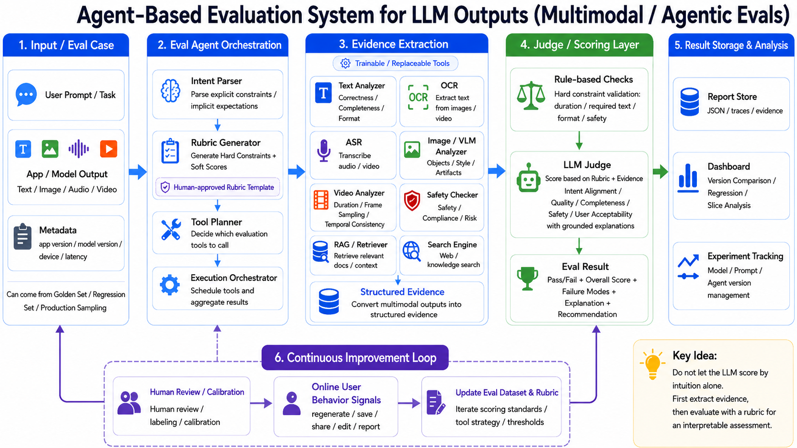

# Agent-Based Multimodal Eval Demo

This is a demo implementation of an agent-based evaluation system, starting with image outputs.



The key idea is simple: do not let a judge model score by intuition alone. First convert the output into structured evidence, then evaluate that evidence against an explicit, portable rubric.

The demo intentionally uses mock image, OCR, and safety tools. The interfaces are shaped so real OCR, VLM, and safety tools can replace the mocks later.

## What This Demo Shows

This repo implements the Phase 1 rule-based loop from `agent_based_multimodal_eval_system_v2.md`:

1. Load an eval case with prompt, model output, modality, and metadata.
2. Load a portable image-generation rubric from config.
3. Parse the prompt into structured task intent, such as required text and negative constraints.
4. Plan which tools to run based on modality, prompt constraints, and rubric requirements.
5. Extract structured evidence with mock image analysis, OCR, and safety tools.
6. Run deterministic hard checks for safety, exact rendered text, and forbidden visual elements.
7. Score soft dimensions with evidence-grounded rules.
8. Aggregate the result into pass/fail, overall score, failure modes, and recommendation.
9. Save a JSON report that can be inspected, compared, or used by a dashboard later.

## Agentic Eval Flow

The "agentic" part is the orchestration around the judge. The system does not simply ask a model, "Is this good?" Instead, it decomposes the evaluation:

- `Intent Parser`: turns the user prompt into structured constraints.
- `Rubric Loader`: loads human-readable scoring rules and thresholds.
- `Tool Planner`: decides which evidence tools are needed.
- `Execution Orchestrator`: runs those tools and gathers their outputs.
- `Rule-Based Checks`: handles hard constraints deterministically.
- `Scoring Layer`: scores soft dimensions from evidence.
- `Report Writer`: stores evidence, scores, failures, versions, and recommendations.

For example, if the prompt says `Include "SPRING SALE"` and `no logos`, the system plans OCR and image analysis automatically. OCR checks whether the exact text appears, while image analysis checks whether forbidden visual elements are detected. The final result cites these evidence sources instead of hiding the decision inside an opaque judge prompt.

## Core Concepts

- **Eval Case**: one test item, including prompt, output, modality, metadata, and optional known failure info.
- **Rubric**: a portable config file containing hard constraints, soft score dimensions, weights, and thresholds.
- **Structured Evidence**: extracted facts about the output, such as OCR text, detected objects, visual artifacts, and safety flags.
- **Hard Constraints**: deterministic pass/fail checks for requirements like safety and exact text.
- **Soft Scores**: weighted quality dimensions such as prompt alignment, visual quality, text rendering, and user acceptability.
- **Eval Report**: the final JSON artifact with pass/fail, overall score, failure modes, recommendation, evidence, and tool versions.

## Run

```bash
cd multimodal_eval_agent
python3 runner.py \
  --case cases/golden/golden_image_001.json \
  --rubric configs/rubrics/image_generation_general_v1.yaml
```

Expected output:

```text
Case: golden_image_001
Pass: true
Overall score: 4.95
Recommendation: Accept
Report saved to reports/golden_image_001/result.json
```

Run a regression case:

```bash
python3 runner.py \
  --case cases/regression/regression_image_missing_text_001.json \
  --rubric configs/rubrics/image_generation_general_v1.yaml
```

## Test

```bash
python3 -m unittest discover tests
```

## Files

- `configs/rubrics/image_generation_general_v1.yaml`: portable rubric config.
- `cases/golden/golden_image_001.json`: passing image eval case.
- `cases/regression/regression_image_missing_text_001.json`: hard failure for missing exact text.
- `src/agents/`: intent parsing, tool planning, and eval orchestration.
- `src/tools/`: mock evidence extraction tools.
- `src/evaluators/`: hard checks and soft score aggregation.
- `src/reporting/`: report writer.
